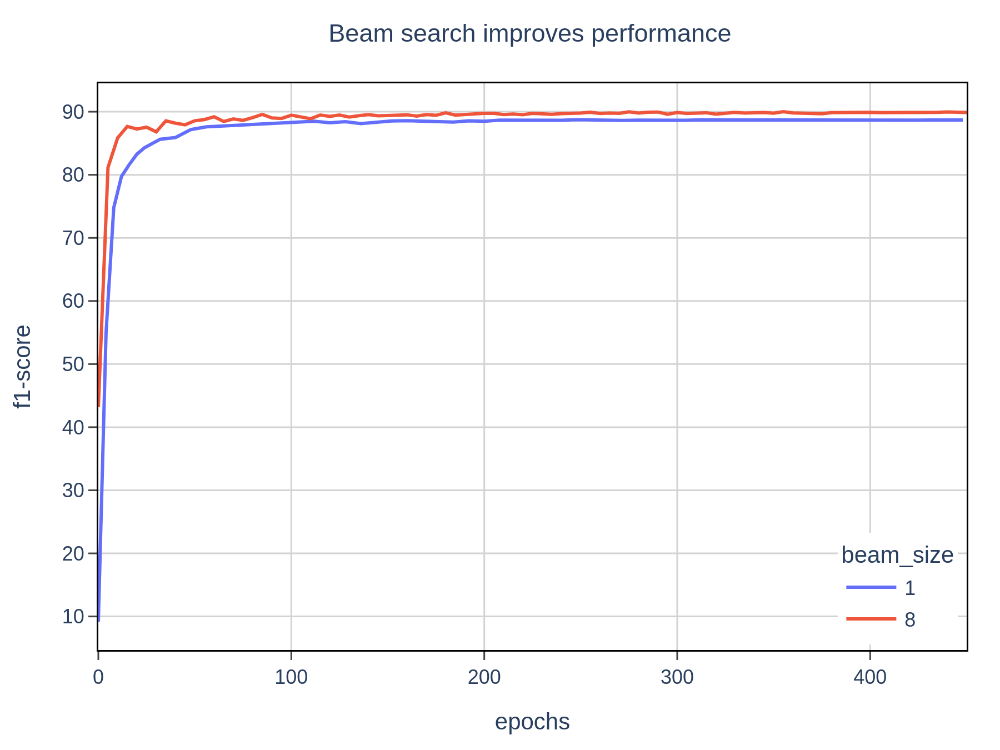

# Named Entity Recognition
Pytorch-lightning implementation of the paper [GCDT: A Global Context Enhanced Deep Transition Architecture for Sequence Labeling](https://arxiv.org/pdf/1906.02437.pdf)


<div >
    
    
</div>
<div align="center">Rewards for grids</div>
<br>

## Installation

### Training Environment
```sh
conda create --name train_ner python=3.8
conda activate train_ner
pip install -r requirements.txt
```

### Inference Environment
```sh
conda create --name infer_ner python=3.8
conda activate infer_ner
pip install -r app/requirements.txt
```

## Running the code
### Training
This stores model checkpoints at [lightning_logs/backup](lightning_logs/backup) after every epoch
```sh
conda activate train_ner
python train.py --base_dir data/conll03 \
    --config_file configs/config.json \
    --epochs 1000
```

### Test
Uses the files in [lightning_logs/backup](lightning_logs/backup) to output metrics as a csv file at [data/conll03/testa_beam8.csv](data/conll03/testa_beam8.csv).
```sh
conda activate train_ner
python test.py
```

### Infer on the webapp
```sh
conda activate infer_ner
python app/main.py
```
